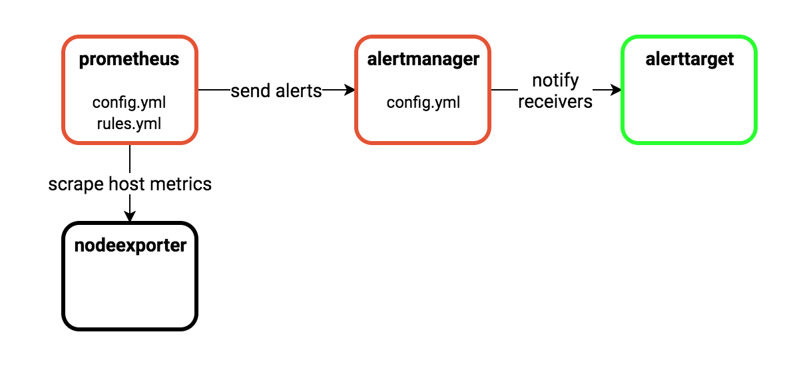

# Alert manager
This example shows a minimal configuration that configures `prometheus` 
with alert rules and prometheus `alertmanager` with settings to manage those alerts

We have set a sample alert in [rules.yml](./prometheus/rules.yml) that will always 
fire so that it's easy to see how the `alertmanager` and `alerttarget` behave.

## Alertmanager
Receives alerts that have fired from prometheus and decides how do respond. 
See: https://prometheus.io/docs/alerting 

## Alerttarget
This is a simple go program used to simulate a target that receives alerts that
have triggered, think pagerduty. 

To view alerts that have been received run `docker logs alertmanager_alerttarget_1`

## Node export
Published metrics from the host machine and makes them available to the prometheus
server for scrping 
See: https://github.com/prometheus/node_exporter 